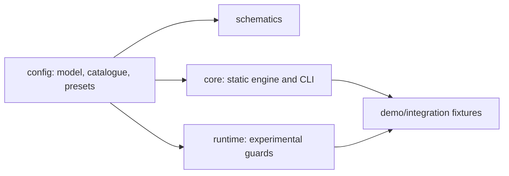

# AAET Architecture

AAET is built with a modular structure comprising four distinct dependency layers. This ensures clean boundaries and prevents runtime code from carrying unnecessary build-time or compilation dependencies.

## Dependency Layers

The diagram below shows the relationships between the modules:

### 1. `libs/config` (Environment-Neutral)
This is the core configuration layer. It is completely environment-neutral and runs anywhere (Node, browser, CLI, schematics). It owns:
- Persisted and effective configuration types.
- Rule presets (`recommended`, `strict`).
- Rule metadata and definitions catalog.
- Legacy configuration migration and schema normalization.
- Configuration validation and secure serialization (stripping secret keys).
- JSON schema creation (`aaet.config.schema.json`).

### 2. `libs/core` (Static Engine & CLI)
This layer owns file operations and static analysis. It depends on Node APIs and runs on development/CI environments. It owns:
- Node filesystem access and workspace loading.
- Static Abstract Syntax Tree (AST) analysis using the TypeScript compiler API.
- Reusable rule executors.
- Diagnostic collection and reporting.
- The `aaet` CLI (`check`, `init`, and `configure` commands).

### 3. `libs/runtime` (Experimental Guards)
This layer contains experimental browser instrumentation that monkey-patches Angular and RxJS APIs. It receives a pre-normalized configuration and executes inside the browser or test runner.
- It **never** interacts with the Node filesystem.
- `setupAaetRuntime` installs selected experimental guards (like RxJS subscription tracking, tick rates, execution duration).
- It returns an idempotent controller with a `teardown()` method that cleanly restores all patched prototypes, avoiding leaks or polluting other tests.

### 4. `libs/schematics` (Angular CLI Adapter)
A thin wrapper that provides a seamless `ng add aaet` experience for Angular CLI developers.
- It delegates all default generation, validation, serialization, and migration logic to `libs/config`.
- User prompts and workspace updates are routed through the standard Angular DevKit schematics interface.

### 5. `apps/demo-app` (Analyzer & Runtime Fixtures)
A testing and integration project containing fixture components, services, and tests (`aaet.spec.ts`) that validate both the static analyzer rules and the runtime instrumentation behavior.
