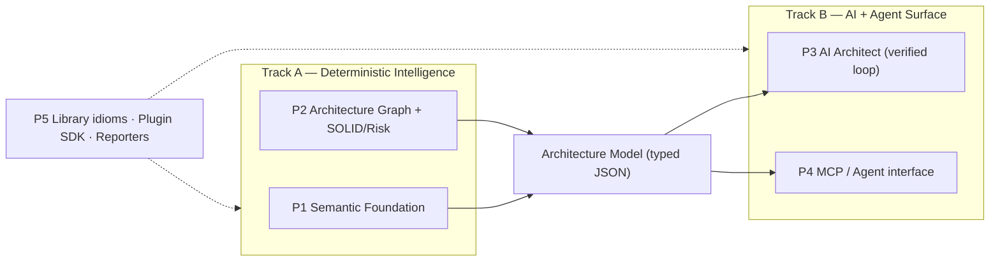

# AAET Strategy: The Architectural Brain for Angular + AI

This document details the forward-looking strategy of AAET, outlining how it will evolve from a syntax-based linter into the primary architectural intelligence layer that makes Angular codebases legible and safely editable by AI.

---

## The Vision

The core product vision is that **AI should do the heavy architectural lifting for developers**—detecting fragile code, identifying design patterns, enforcing SOLID principles, and generating verified refactoring plans.

To realize this vision, AAET is closing the gap between raw AI capabilities and compiler-grade deterministic code validation.

---

## Two Parallel Tracks

Development is organized into two parallel tracks that meet at a shared, typed **Architecture Model** contract (a serialized JSON model representing files, symbols, layers, edges, violations, and fix-patterns).

### Track A: Deterministic Intelligence (The Ground Truth)
Focuses on building high-fidelity analyzers that gather the deterministic facts about the codebase.

### Track B: AI & Agent Surface (The Action Layer)
Focuses on exposing those facts to LLMs and coding agents, allowing them to make smart modifications and verifying their output.

---

## Feature Pillars

### P1. Semantic Foundation (Track A, Core Priority)
Replace naive string matching and regexes with a real semantic analyzer:
- **TypeScript Compiler APIs**: Build an incremental `ts.Program` and query the `TypeChecker` to resolve symbol origins, custom imports, and path aliases.
- **Angular Compiler Integration**: Parse Angular HTML templates into an AST, allowing precise AST queries for method calls (`[prop]="method()"`), binding targets, and control flow.

### P2. Architecture Graph & SOLID Risk Scoring (Track A)
Build a program-wide dependency graph that understands layered relations and identifies risk areas:
- **SOLID Heuristics**: Detect violations of Single Responsibility (SRP), Dependency Inversion (DIP), and Open-Closed (OCP) principles.
- **Risk Score**: Score files based on circular dependencies, active subscription leak-risks, high-frequency change-detection triggers, and git-based churn analysis.

### P3. AI Architect: Grounded, Closed-Loop Verification (Track B)
Move beyond simple explanations to a **Plan $\rightarrow$ Patch $\rightarrow$ Verify** loop:
- **Context Injection**: Provide the AI model with a scoped slice of the Architecture Model (the violating code, its graph neighbors, and configuration rules).
- **Automated Verification**: When the AI proposes a patch, AAET applies it in-memory, then runs typechecks and AST rules. If the patch introduces compile errors or new violations, it is rejected and sent back to the model for correction.

### P4. Agent Interface via Model Context Protocol (MCP) (Track B)
Expose AAET as an **MCP Server** so coding agents (like Cursor, Copilot, or Claude Code) can query it during development:
- `get_architecture_context(file)`: Query layers, neighbors, and rules.
- `would_violate(proposed_change)`: Run a dry-run check before writing code.
- `verify_change(diff)`: Trigger the P3 verification loop on the agent's proposed change.

### P5. Idioms, Plugin SDK, & Integration (Cross-cutting)
- **Library Idiom Packs**: Pre-configured rules representing best practices for RxJS, signals, NgRx, and Angular Material.
- **Rule Plugin SDK**: A public API allowing engineering teams to write and register custom architectural rules.
- **CI Reporters**: Standard SARIF format output to enable PR annotation integrations.

---

## Scope: Development-Time Only

AAET is strictly a development and CI utility.
- All heavy analysis dependencies (TypeScript compiler, Angular compiler, MCP SDK) are strictly configured as `devDependencies`.
- The runtime instrumentation layer (`libs/runtime`) is restricted to local development/testing builds and must be tree-shaken out of production code.
