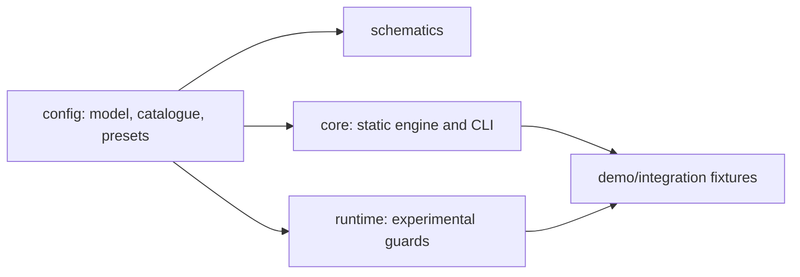

# AAET Architecture

AAET has four dependency layers:

`libs/config` is environment-neutral. It owns persisted and effective types, presets, rule metadata, validation, legacy normalization, merging, secure serialization, and JSON schema creation.

`libs/core` owns Node filesystem access, workspace configuration loading, static AST rules, output, and the `aaet` CLI. Disabled rule groups do not execute; emitted diagnostics carry their resolved severity.

`libs/runtime` receives an already-normalized configuration. It never loads files. `setupAaetRuntime` installs only selected experimental guards and returns an idempotent controller that restores patched methods during teardown.

`libs/schematics` is a thin Angular CLI adapter. It delegates defaults, migration, merging, validation, and serialization to `libs/config`; terminal interaction belongs to the reusable CLI or Angular schema prompts.
