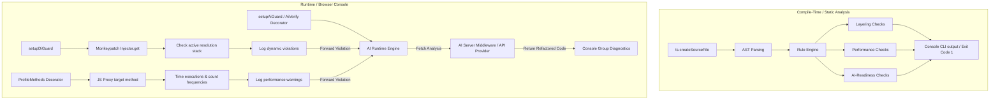

# AAET Architecture

This document provides a high-level overview of the **Angular Architectural Enforcement Toolkit (AAET)** architecture and how it enforces code quality and boundary conditions.

---

## 🗺️ Enforcement Model: Dual-Layer Shield

AAET works on two distinct levels of the development lifecycle: **Compile-Time** (Static Analysis) and **Runtime** (Dev Mode Interception).

---

## 📂 Core Architectural Layers

AAET defines rules around three core layers:

1. **UI Layer (`ui`):**
   * Represents components (`.component.ts`).
   * Rules: Cannot import direct API services (`api`). Must only depend on the state facade layer (`facade`). Must not contain raw RxJS subjects (Signals are preferred).
2. **Facade Layer (`facade`):**
   * Represents domain facades (`.facade.service.ts`).
   * Rules: Acts as a gateway between UI and raw API calls. Allowed to depend on API services.
3. **API Layer (`api`):**
   * Represents raw infrastructure services (`.api.service.ts`).
   * Rules: Direct HTTP/REST or WebSocket calls. Must not depend on UI layers.

---

## ⚡ Core Rules & Rules Engine

The static rules engine in [libs/core](file:///Users/maxim.berenshtein/WebstormProjects/aaet/libs/core) processes rules against each TypeScript file:

| Rule ID | Layer | Description |
| :--- | :--- | :--- |
| `STRICT_LAYERING` | Compile-Time | Blocks imports from unauthorized layers (e.g. `ui` -> `api`). |
| `MAX_DI_LIMIT` | Compile-Time | Enforces the Single Responsibility Principle by limiting the count of injected services (constructor + `inject()`). |
| `ONE_SHOT_CONTEXT_LIMIT` | Compile-Time | Restricts file length (in lines) to keep files concise and clean for AI context windows. |
| `EXPLICIT_TOKEN_ECONOMY` | Compile-Time | Mandates return type annotations on public class methods for predictable AI code generation. |
| `LEGACY_DECORATOR` | Compile-Time | Forbids `@Input()` and `@Output()`, mandating modern Angular `input()` and `output()` APIs. |
| `FORBID_RAW_RXJS_UI` | Compile-Time | Disallows raw RxJS subjects in UI components, pushing developers to adopt Angular Signals. |
| `TEMPLATE_METHOD_CALL` | Compile-Time | Flags method calls in HTML templates which trigger expensive evaluation on every Change Detection cycle. |
| `ROUTING_LAZY_LOAD_VIOLATION` | Compile-Time | Detects static component imports in routing configuration instead of dynamic `loadComponent()`. |
| `DEFER_LAZY_LOAD_VIOLATION` | Compile-Time | Flags static imports of components that are otherwise used in `@defer` templates. |
| `AI_VERIFY_DECORATOR` | Runtime | Manually triggers AI review on class instantiation using the `@AiVerify` decorator. |
| `MUTABLE_SIGNAL_IN_COMPUTED` | Runtime | Automatically triggers AI review if a writable signal is mutated inside a computed() context. |
| `SLOW_METHOD_EXECUTION` | Runtime | Triggers AI review when a class method takes too long to execute. |
| `ZONE_BLOCKING_TASK` | Runtime | Triggers AI review when a task blocks the Angular zone for too long. |

