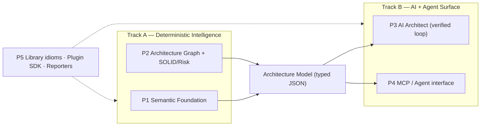

# AAET Strategy: The Architectural Brain for Angular + AI

This document is the forward strategy for AAET. It captures the vision, the unique
positioning, and a prioritized set of features intended to make AAET the best-in-class
tool for writing better Angular architectural code with AI doing the heavy lifting.
It is a planning reference for implementation, not a record of shipped work — see
`docs/roadmap.md` for current status and `docs/architecture.md` for today's layering.

## Context

AAET is a working three-tier Angular analyzer: a **static** engine (default),
**runtime** guards (opt-in, experimental), and an **AI** explainer (opt-in). It already
ships a CLI (`aaet check/init/configure`), an `ng-add` schematic, ESLint/Vite/Webpack
adapters, a versioned configuration model (`libs/config`), and an `.ai-context.md`
generator. The skeleton and the "AI-readiness" framing are ahead of comparable tools.

The product vision is that **AI does the architectural work for developers** —
understanding patterns, knowing the relevant libraries and tools, spotting fragile code,
and preserving SOLID principles during refactors. The current engine cannot yet
*truthfully* support that vision, because it lacks a semantic ground truth:

- Static analysis uses `ts.createSourceFile` only — no `ts.Program`, no `TypeChecker`
  (`libs/core/src/index.ts:99`). It cannot resolve symbols, `tsconfig` path aliases
  (`@app/*`), or re-exports.
- Templates and several rules are regex/string-matched, not parsed — e.g. `*ngIf`
  detection, `{{ method() }}` detection, `decoratorText.startsWith('Input')`,
  `condText.includes('isPlatformBrowser')`. This produces false positives and negatives.
- There is no `@angular/compiler` dependency at all (runtime deps are `typescript`,
  `minimatch`, `@angular-devkit/schematics` — `package.json`).
- Layering is evaluated on per-file import strings, not a project graph — so there is no
  cycle detection, coupling analysis, or SOLID reasoning.
- The AI layer is a single-shot "explain + suggest snippet" call with no caching,
  retries, streaming, project context, or verification (`libs/core/src/ai-check.server.ts`);
  autofix was removed.
- Rules are hardcoded (`libs/core/src/index.ts:43`); there is no plugin API for a team's
  own patterns.

The current roadmap already names the two foundational gaps (`docs/roadmap.md`):
*"Replace path/name heuristics with TypeScript program module resolution"* and
*"Parse Angular templates with the Angular compiler."*

**Intended outcome.** Turn AAET from "another Angular linter" into the **architectural
intelligence layer that makes Angular codebases legible and safely editable by AI** —
accurate enough that AI can trust it, structural enough that it sees patterns, coupling,
and SOLID, and connected enough that coding agents consult it as a live guardrail.

## Scope: development-only

AAET is a development-only toolchain. It runs at development time, build time, and in CI;
it must have zero footprint in production. Concretely:

- Nothing AAET adds may ship in the application's production bundle. Analysis dependencies
  (`@angular/compiler`, the TypeScript program, the MCP SDK) are devDependencies.
- The runtime tier (`libs/runtime`) is a development-only diagnostic. Its guards
  monkey-patch Angular internals (`Observable.subscribe`, `NgZone.run`,
  `ApplicationRef.tick`, `Injector.get`, signals) and must be gated behind a
  development-mode check and tree-shaken out of production builds — never installed in a
  production runtime.
- The AI layer runs only at development and CI time. API keys and model calls are never
  bundled into or executed from the production application (consistent with the existing
  server-side key resolution in `libs/core/src/ai-check.server.ts`).
- The MCP/agent surface (P4) is inherently a development-time tool used by coding agents.

This constraint is a feature, not a limitation: production stays untouched while AAET does
the architectural work during development.

## The unique wedge

No existing tool combines all four capabilities below. AAET already has the skeleton for
each one, which is what makes the combination achievable rather than aspirational.

| Capability | angular-eslint / Codelyzer | Nx boundaries / Sheriff | dep-cruiser / Madge / ts-arch | SonarQube | Copilot / Cursor / Claude Code | AAET (target) |
|---|---|---|---|---|---|---|
| Angular-compiler-grade semantics (TS types **and** template AST) | partial | no | no | partial | no | **yes** |
| Project-wide architecture graph + SOLID/coupling analysis | no | boundaries only | cycles only | smells only | no | **yes** |
| Grounded **and verified** AI architect (plan → patch → re-verify) | no | no | no | shallow | ungrounded | **yes** |
| Agent/MCP interface — AI consults it as ground truth | no | no | no | no | n/a | **yes** |

**Positioning statement.** AAET is the architectural brain for Angular + AI: a
compiler-grade analyzer and project graph that AI agents query to understand patterns,
spot fragile code, and refactor while preserving SOLID — with every AI change verified
against deterministic rules before it is trusted.

## Mapping objectives to features

| Objective | Delivered by |
|---|---|
| Understand patterns | **P2** architecture graph + design-pattern detection; **P3** AI pattern recognition grounded in the graph |
| Know libraries and tools | **P5** library/idiom awareness (RxJS, signals, NgRx, Material, Nx) + **P1** type resolution to know real symbol origins |
| Find flaky places in code | **P2** risk/fragility scoring (leak-prone, change-detection hotspots, SSR hazards, churn × complexity); runtime guards as live evidence |
| Preserve SOLID principles | **P2** SOLID heuristics (SRP/DIP/OCP/ISP) + **P3** AI refactors gated so they cannot regress them |
| Let AI do the work | **P3** AI architect closed loop + **P4** MCP/agent surface |

## Two parallel tracks

Work proceeds on two tracks that advance in parallel:

- **Track A — Deterministic Intelligence:** the ground truth that AI stands on.
- **Track B — AI + Agent Surface:** what makes AI do the work.

They meet at one contract: a stable **Architecture Model** (typed JSON describing files,
symbols, layers, edges, violations, metrics, and fix-patterns). Track A produces it;
Track B consumes it. Freezing this contract early is what lets both tracks move at once
without blocking each other.

## Feature pillars

### P1 — Semantic Foundation (Track A, highest priority)

Replace syntactic and regex analysis with real semantics.

- Build a cached `ts.Program` + `TypeChecker` (incremental / watch-aware) instead of
  per-file `createSourceFile`. Resolve symbols, `tsconfig` `paths`, re-exports, and real
  decorator origins (`@angular/core`).
- Add `@angular/compiler` to parse templates (inline and `templateUrl`) into a template
  AST. Replace every regex template rule (`TEMPLATE_METHOD_CALL`,
  `LEGACY_TEMPLATE_CONTROL_FLOW`, `@defer`) with AST queries that also cover property and
  event bindings (`[x]="f()"`), not just `{{ }}` interpolation.

Why it matters: this removes the false-positive/negative class that makes today's output
untrustworthy, and nothing downstream (AI, agents) can be trusted until it exists. It is
the credibility floor.

Engines: TypeScript compiler API, Angular compiler.
Touches: `libs/core/src/index.ts`, `libs/core/src/context/config-manager.ts`, all of
`libs/core/src/rules/*`, `package.json` dependencies.

### P2 — Architecture Graph and SOLID/Risk Intelligence (Track A)

Build a whole-program dependency graph (symbol- and layer-level, alias-aware) on top of
P1, then run graph-level analyses that per-file linting cannot:

- Circular dependencies; layering violations across re-exports; fan-in/fan-out hotspots;
  "god" files and services.
- SOLID heuristics: SRP (cohesion / responsibility count), DIP (concrete-vs-abstract
  imports), OCP (the existing `SWITCH_STRATEGY_SMELL`, generalized), ISP (fat interfaces).
- A "flaky places" risk score that combines leak-prone subscriptions, change-detection
  hotspots, SSR hazards, untyped public boundaries, and (via git) churn × complexity into
  a ranked fragility report.

Why it matters: this is the leap from *linter* to *architect*. Nx and Sheriff stop at
module boundaries; AAET reasons about design principles and fragility. It directly serves
the "understand patterns", "flaky places", and "SOLID" objectives.

Engines: TypeScript TypeChecker, graph algorithms, git metadata.
Touches: new `libs/core/src/graph/*`; new metrics consumers; extends
`libs/config/src/catalog.ts`.

### P3 — AI Architect: grounded, closed-loop, verified (Track B, the differentiator)

Upgrade AI from "explain a violation" to **plan → patch → re-verify**:

- Feed the AI the Architecture Model slice (the file plus its graph neighborhood, the
  exact rule, and the project's own layering/config), not just a single-file blob.
- The AI returns a concrete patch; AAET applies it in-memory and re-runs P1 analysis,
  `tsc` typecheck, and the P2 graph — surfacing only fixes that provably remove the
  violation without introducing new violations, type errors, or SOLID regressions. This
  is the roadmap's "previewed patches with parse, typecheck, and explicit apply gates,"
  elevated to a core feature.
- Production hardening the current client lacks: caching, batching, retries, streaming,
  timeouts, latest Claude models, and a model-agnostic provider interface.

Why it matters: "AI does the work" *safely*. The verification loop is the trust mechanism
that no general coding assistant has — AAET grounds and checks the AI against
deterministic architecture rules.

Engines: Claude (latest), TypeScript Program for re-verification, P1/P2 as the oracle.
Touches: `libs/core/src/ai-check.server.ts`, `libs/runtime/src/ai-guard.ts`, a new
verify/patch module.

### P4 — Agent Interface (MCP server) (Track B)

Expose the Architecture Model and the AI loop as an MCP server so coding agents (Claude
Code, Cursor, Copilot) consult AAET live:

- `get_architecture_context(file | symbol)` — layers, rules, neighbors, and patterns in
  scope.
- `would_violate(proposed_change)` — check *before* the agent writes code.
- `get_fix_pattern(ruleId)` and `verify_change(diff)` — the canonical fix plus the P3
  verification loop.
- Evolve `.ai-context.md` (today one static global dump — `libs/core/src/index.ts:138`)
  into per-directory, always-fresh context derived from the live model.

Why it matters: this is the literal realization of "instead of developers, AI does the
architectural work." AAET becomes the guardrail and knowledge source every Angular coding
agent plugs into — a durable, defensible position.

Engines: MCP, the Architecture Model.
Touches: new `libs/mcp/*`; reuses `libs/core` and `libs/config`.

### P5 — Library/Idiom Awareness, Plugin SDK, and Reporters (both tracks)

- **Library awareness:** ship idiom packs that understand RxJS, signals,
  NgRx/SignalStore, Angular Material, and Nx, so rules and AI speak each library's correct
  patterns. This serves the "libraries and tools" objective.
- **Plugin SDK:** a public `Rule` API plus registration so teams encode their own patterns
  and SOLID rules without forking (today rules are hardcoded in
  `libs/core/src/index.ts:43`).
- **Reporters:** SARIF and JSON output (a roadmap item) for PR annotations, CI, and
  dashboards.

Why it matters: it captures each team's unique architecture and teaches the AI
project-specific idioms; SARIF unlocks the CI surface.
Touches: new `libs/core/src/rules/registry`, new `libs/core/src/reporters/*`,
`libs/config/src/catalog.ts`.

## Surfaces

The pillars are surface-agnostic; each surface is a thin adapter over the same
Architecture Model and AI loop. All three are intended deliverables.

| Surface | What it is | Built on | Adapter location |
|---|---|---|---|
| Agent / MCP (lead) | Agents query architecture, pre-check changes, request and verify fixes | P1, P2, P3, P4 | new `libs/mcp` |
| CLI + CI gate | `aaet check` with SARIF/JSON, AI explanations, gated autofix patches | P1, P2, P3, P5 | `libs/core/src/cli.ts`, reporters |
| IDE inline | Real-time diagnostics + inline AI fixes while typing | P1, P3 | `libs/core/src/eslint/eslint-rule.ts`, `libs/core/src/plugins/vite-plugin.ts`; optional LSP later |

## Phased rollout

The two tracks run in parallel and converge.

- **Phase 0 — Define the Architecture Model contract.** The typed JSON both tracks share.
  Do this first; it unblocks parallel work.
- **Phase 1 (parallel).**
  - Track A: P1 semantic foundation (Program/TypeChecker + Angular template AST); migrate
    the worst regex rules first (templates, layering, platform-isolation, decorators).
  - Track B: P3 AI hardening (caching, retries, streaming, latest models) plus the verify
    loop scaffold, running against the current engine initially and swapping to P1's model
    as it lands.
- **Phase 2 (parallel).**
  - Track A: P2 graph plus SOLID/risk metrics.
  - Track B: P4 MCP server (read-only context first); per-directory `.ai-context.md`.
- **Phase 3 — Convergence and ecosystem.** P5 library idiom packs, plugin SDK, and
  SARIF/JSON reporters; full gated autofix across all three surfaces; validation of
  runtime guards on a real Angular app (a roadmap item).

## Risks and guardrails

- **Production footprint:** AAET is development-only. The runtime tier must be gated to
  development mode and tree-shaken from production; AAET dependencies stay as
  devDependencies and must never enter the application's production bundle.
- **AI trust:** never apply an AI patch that has not passed P1 + P2 + `tsc`
  re-verification. The deterministic engine is always the oracle.
- **Performance:** a full `ts.Program` is heavier than `createSourceFile` — use
  incremental/watch programs and cache the graph; keep a fast syntactic path for
  editor-hot loops.
- **Compiler coupling:** pin `@angular/compiler` to the workspace's Angular version (the
  version `ConfigManager` already detects); template-AST APIs shift across majors.
- **Scope:** parallel tracks raise coordination cost — the Phase 0 contract is the
  mitigation; do not start P3/P4 deep work before it is frozen.

## Acceptance criteria

- **P1:** on `apps/demo-app/fixtures`, semantic rules match the existing
  intended-violation set with zero regex false positives; add fixtures for path-alias
  imports, re-exported cross-layer imports, and `[prop]="method()"` bindings the old
  engine missed. Dogfooding on `libs/` stays clean.
- **P2:** the graph report flags a seeded circular dependency and a seeded SRP/DIP
  violation in fixtures; the risk score ranks a known leak-prone component highest.
- **P3:** for each fixture violation, the AI loop returns a patch that, after in-memory
  apply, yields zero violations and zero type errors; it rejects and explains when it
  cannot.
- **P4:** from a real MCP client (Claude Code), `get_architecture_context` and
  `would_violate` return correct results for a fixture file; an agent-proposed change that
  breaks layering is caught before it is written.
- **P5:** a sample custom plugin rule loads and fires; SARIF output validates against the
  SARIF schema and renders as PR annotations.

Validation runs via the existing harness: `nx run demo-app:test` (Vitest fixtures in
`apps/demo-app/src/aaet.spec.ts`), the `aaet check` CLI, and a live MCP client for P4.

## Critical files

- Engine entry / rule registration: `libs/core/src/index.ts`
- Config + Angular-version/workspace detection: `libs/core/src/context/config-manager.ts`
- Rules to make semantic: `libs/core/src/rules/` (`paradigm`, `performance`, `layering`,
  `patterns`, `ai-readiness`)
- AI layer: `libs/core/src/ai-check.server.ts`, `libs/runtime/src/ai-guard.ts`
- Config model / rule catalog: `libs/config/src/catalog.ts`, `libs/config/src/types.ts`
- Surfaces: `libs/core/src/cli.ts`, `libs/core/src/eslint/eslint-rule.ts`,
  `libs/core/src/plugins/`
- New: `libs/core/src/graph/*`, `libs/core/src/reporters/*`, `libs/mcp/*`
- Dependencies to add (as devDependencies — AAET is development-only): `@angular/compiler`
  (pinned to the workspace Angular version), an MCP SDK.
